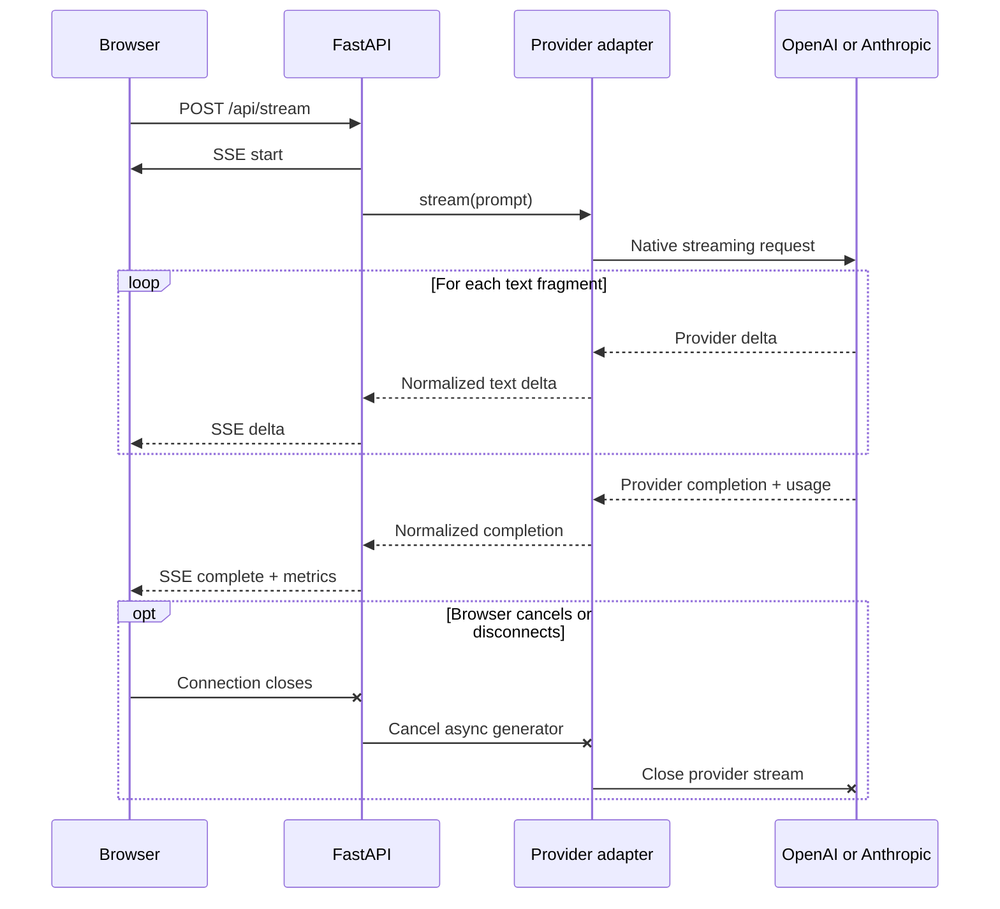

# AI Learning

A project-based path from notebook experiments to production AI applications.
The repository will grow into **KnowledgeDesk**, a deployed support and research
assistant built through ten incremental releases.

## Curriculum

- [Production AI self-learning guide](PRODUCTION_AI_SELF_LEARNING_GUIDE.md)
- [Learning progress tracker](LEARNING_PROGRESS_TRACKER.md)

## Local setup

This project uses [uv](https://docs.astral.sh/uv/) for Python and dependency
management.

```bash
uv sync --locked --no-editable
uv run --no-sync ai-learning
```

The Python version is pinned in `.python-version`, while exact dependency
versions are recorded in `uv.lock`.

## Week 1: run PromptBench

Install the locked development environment and start the FastAPI server:

```bash
uv sync --locked --no-editable
uv run --no-sync uvicorn --app-dir src app.main:app --reload
```

Open [http://127.0.0.1:8000](http://127.0.0.1:8000) for the browser UI or
[http://127.0.0.1:8000/docs](http://127.0.0.1:8000/docs) for the generated API
documentation.

The browser UI can stream a prompt through either configured provider. API keys
remain on the server; the browser sends only the selected provider, configured
model, and prompt to `POST /api/stream`. FastAPI converts both native provider
streams into the same server-sent event contract:

- `start` identifies the application request, provider, and model.
- `delta` contains one incremental text fragment.
- `complete` reports latency, token usage, finish reason, and provider request ID.
- `error` safely reports a failure after streaming response headers were sent.

PromptBench currently exposes:

- `GET /health/live` confirms that the web process can serve requests.
- `GET /health/ready` confirms that both provider keys are configured,
  without making a paid provider request.
- `POST /api/generate` validates a prompt and makes one non-streaming provider
  call through the selected direct SDK adapter.
- `POST /api/stream` validates the same request and streams normalized SSE events
  from the selected direct SDK adapter.

The readiness endpoint returns HTTP `503` until both `OPENAI_API_KEY` and
`ANTHROPIC_API_KEY` are available. The application reads local development
values from the ignored `.env` file and uses normal environment variables in
deployed environments.

Generation requests have an 8,000-character prompt limit, a configured total
provider deadline, a model allowlist, and a stable error response. The output
limit remains 64 tokens by default to control learning costs. Default application
logs include provider, model, latency, usage, finish reason, and request IDs, but
exclude API keys, prompts, and model response text. Cancelling the browser request
closes the upstream provider stream.

### Streaming request flow



## Week 1: deployed PromptBench

PromptBench is deployed at
[ai-learning-promptbench.onrender.com](https://ai-learning-promptbench.onrender.com/)
as a Render Free Python web service. Both OpenAI and Anthropic streaming paths
were verified end to end.

The repository's [`render.yaml`](render.yaml) installs locked production
dependencies, starts Uvicorn on the platform-provided port, uses
`/health/ready` as the health check, and waits for GitHub CI before automatically
deploying a commit. See the [Week 1 evidence](docs/evidence/week-1/README.md) for
the measured provider calls, screenshots, cost sample, cold-start observation,
and controlled invalid-key exercise. The
[Render deployment runbook](docs/RENDER_DEPLOYMENT.md) covers:

- creating the Blueprint and entering provider keys as Render secrets;
- validating health, streaming, cancellation, logs, and cold starts;
- deliberately exercising the safe invalid-key path;
- rolling back a failed deployment; and
- recording release evidence without committing credentials.

The measured Free-tier cold request took more than 30 seconds, while the
immediate warm request completed in 0.153 seconds. This deployment is suitable
for learning, not an availability-sensitive production service.

## Week 2: Ticket Triage API

Week 2 is building a deployed classifier that converts a fictional support
ticket into validated structured data. `POST /api/triage` accepts a ticket plus
an allowlisted provider and model, then returns category, priority, summary,
sentiment, requested action, human-review status, confidence, rationale, and
operational telemetry. The Ticket Triage tab exercises that route through the
browser while preserving the Week 1 prompt playground.

Both direct provider adapters request the same strict `TicketTriage` Pydantic
model through their SDK-native structured-output helpers. A missing, extra,
mistyped, refused, or truncated result fails closed before FastAPI constructs a
success response. Ticket input is serialized as untrusted JSON and kept separate
from system instructions.

This slice intentionally has no ticket database: request text is processed in
memory, not persisted, and omitted from application logs. The six committed
fixtures are fictional evaluation inputs rather than saved user tickets. Triage
output has a separate 256-token default cap because the eight-field schema needs
more room than PromptBench's intentionally small 64-token prose limit.

Non-streaming generation and ticket triage use one application-owned retry
policy. Provider SDK retries are disabled, so the service can report and bound
every attempt itself. The default policy allows three total attempts, applies
exponential backoff with bounded jitter only to rate limits, provider timeouts,
connection/unavailability errors, `408`, `409`, and `5xx` responses, and keeps
calls plus backoff inside the existing 30-second total deadline. Authentication,
invalid requests, invalid structured output, cancellations, and unknown failures
are not retried. Successful non-streaming responses include `attempt_count`, and
retry logs omit prompt and ticket text.

Streaming responses are deliberately not replayed. Once SSE fragments may have
reached a browser, automatically starting a second provider request could
duplicate or splice output.

See [ADR 0001](docs/decisions/0001-ticket-triage-contract.md) for the contract
boundaries and why Jira integration is intentionally outside this week's scope.
See [ADR 0002](docs/decisions/0002-native-structured-output.md) for the direct
SDK implementation and failure policy. The underlying provider features are
documented by the
[OpenAI structured outputs guide](https://developers.openai.com/api/docs/guides/structured-outputs)
and the
[Anthropic structured outputs guide](https://platform.claude.com/docs/en/build-with-claude/structured-outputs).
See [ADR 0003](docs/decisions/0003-application-owned-retries.md) for retry
classification, deadline, jitter, and streaming decisions.

## OpenAI connectivity check

Create a local environment file and add your project API key to it:

```bash
cp .env.example .env
```

Never commit `.env`. Once `OPENAI_API_KEY` is set, install the locked project
and run the low-cost connectivity check:

```bash
uv sync --locked --no-editable
uv run --no-sync --env-file .env openai-check
```

The command uses the Responses API with the model configured by
`OPENAI_MODEL` and does not store the response.

## Anthropic connectivity check

Add `ANTHROPIC_API_KEY` to the same ignored local `.env` file, then run:

```bash
uv sync --locked --no-editable
uv run --no-sync --env-file .env anthropic-check
```

The command sends a minimal Messages API request using the model configured by
`ANTHROPIC_MODEL`.

## Repository hygiene

Commit source code, project configuration, migrations, tests, documentation,
and `uv.lock`. Do not commit virtual environments, secrets, local caches,
logs, or generated build artifacts; these are covered by `.gitignore`.
