# AI Learning

A project-based path from notebook experiments to production AI applications.
The repository will grow into **KnowledgeDesk**, a deployed support and research
assistant built through ten incremental releases.

## Curriculum

- [Production AI self-learning guide](PRODUCTION_AI_SELF_LEARNING_GUIDE.md)
- [Learning progress tracker](LEARNING_PROGRESS_TRACKER.md)

## Local setup

This project uses [uv](https://docs.astral.sh/uv/) for Python and dependency
management.

```bash
uv sync --locked --no-editable
uv run --no-sync ai-learning
```

The Python version is pinned in `.python-version`, while exact dependency
versions are recorded in `uv.lock`.

## Week 1: run PromptBench

Install the locked development environment and start the FastAPI server:

```bash
uv sync --locked --no-editable
uv run --no-sync uvicorn --app-dir src app.main:app --reload
```

Open [http://127.0.0.1:8000](http://127.0.0.1:8000) for the browser UI or
[http://127.0.0.1:8000/docs](http://127.0.0.1:8000/docs) for the generated API
documentation.

The browser UI can stream a prompt through either configured provider. API keys
remain on the server; the browser sends only the selected provider, configured
model, and prompt to `POST /api/stream`. FastAPI converts both native provider
streams into the same server-sent event contract:

- `start` identifies the application request, provider, and model.
- `delta` contains one incremental text fragment.
- `complete` reports latency, token usage, finish reason, and provider request ID.
- `error` safely reports a failure after streaming response headers were sent.

PromptBench currently exposes:

- `GET /health/live` confirms that the web process can serve requests.
- `GET /health/ready` confirms that both provider keys are configured,
  without making a paid provider request.
- `POST /api/generate` validates a prompt and makes one non-streaming provider
  call through the selected direct SDK adapter.
- `POST /api/stream` validates the same request and streams normalized SSE events
  from the selected direct SDK adapter.

The readiness endpoint returns HTTP `503` until both `OPENAI_API_KEY` and
`ANTHROPIC_API_KEY` are available. The application reads local development
values from the ignored `.env` file and uses normal environment variables in
deployed environments.

Generation requests have an 8,000-character prompt limit, a configured total
provider deadline, a model allowlist, and a stable error response. The output
limit remains 64 tokens by default to control learning costs. Default application
logs include provider, model, latency, usage, finish reason, and request IDs, but
exclude API keys, prompts, and model response text. Cancelling the browser request
closes the upstream provider stream.

### Streaming request flow

```mermaid
sequenceDiagram
    participant B as Browser
    participant A as FastAPI
    participant P as Provider adapter
    participant M as OpenAI or Anthropic

    B->>A: POST /api/stream
    A->>B: SSE start
    A->>P: stream(prompt)
    P->>M: Native streaming request
    loop For each text fragment
        M-->>P: Provider delta
        P-->>A: Normalized text delta
        A-->>B: SSE delta
    end
    M-->>P: Provider completion + usage
    P-->>A: Normalized completion
    A-->>B: SSE complete + metrics
    opt Browser cancels or disconnects
        B-xA: Connection closes
        A-xP: Cancel async generator
        P-xM: Close provider stream
    end
```



## Week 1: deployed PromptBench

PromptBench is deployed at
[ai-learning-promptbench.onrender.com](https://ai-learning-promptbench.onrender.com/)
as a Render Free Python web service. Both OpenAI and Anthropic streaming paths
were verified end to end.

The repository's [`render.yaml`](render.yaml) installs locked production
dependencies, starts Uvicorn on the platform-provided port, uses
`/health/ready` as the health check, and waits for GitHub CI before automatically
deploying a commit. See the [Week 1 evidence](docs/evidence/week-1/README.md) for
the measured provider calls, screenshots, cost sample, cold-start observation,
and controlled invalid-key exercise. The
[Render deployment runbook](docs/RENDER_DEPLOYMENT.md) covers:

- creating the Blueprint and entering provider keys as Render secrets;
- validating health, streaming, cancellation, logs, and cold starts;
- deliberately exercising the safe invalid-key path;
- rolling back a failed deployment; and
- recording release evidence without committing credentials.

The measured Free-tier cold request took more than 30 seconds, while the
immediate warm request completed in 0.153 seconds. This deployment is suitable
for learning, not an availability-sensitive production service.

## Week 2: Ticket Triage API

Week 2 is building a deployed classifier that converts a fictional support
ticket into validated structured data. `POST /api/triage` accepts a ticket plus
an allowlisted provider and model, then returns category, priority, summary,
sentiment, requested action, human-review status, confidence, rationale, and
operational telemetry. The Ticket Triage tab exercises that route through the
browser while preserving the Week 1 prompt playground.

Both direct provider adapters request the same strict `TicketTriage` Pydantic
model through their SDK-native structured-output helpers. A missing, extra,
mistyped, refused, or truncated result fails closed before FastAPI constructs a
success response. Ticket input is serialized as untrusted JSON and kept separate
from system instructions.

This slice intentionally has no ticket database: request text is processed in
memory, not persisted, and omitted from application logs. The 30 committed
fixtures are fictional evaluation inputs rather than saved user tickets. A
bounded, process-local recorder keeps at most 1,000 safe triage usage events by
default: request ID, operation, provider/model, total duration, successful token
counts, attempt count, outcome, normalized error kind, and timestamp. Its schema
cannot hold ticket text or model output, and no public endpoint exposes the
records. The recorder is injected behind an async interface that a durable
Postgres implementation will replace in Week 3. Triage output has a separate
256-token default cap because the eight-field schema needs more room than
PromptBench's intentionally small 64-token prose limit.

Non-streaming generation and ticket triage use one application-owned retry
policy. Provider SDK retries are disabled, so the service can report and bound
every attempt itself. The default policy allows three total attempts, applies
exponential backoff with bounded jitter only to rate limits, provider timeouts,
connection/unavailability errors, `408`, `409`, and `5xx` responses, and keeps
calls plus backoff inside the existing 30-second total deadline. Authentication,
invalid requests, invalid structured output, cancellations, and unknown failures
are not retried. Successful non-streaming responses include `attempt_count`, and
retry logs omit prompt and ticket text.

Streaming responses are deliberately not replayed. Once SSE fragments may have
reached a browser, automatically starting a second provider request could
duplicate or splice output.

See [ADR 0001](docs/decisions/0001-ticket-triage-contract.md) for the contract
boundaries and why Jira integration is intentionally outside this week's scope.
See [ADR 0002](docs/decisions/0002-native-structured-output.md) for the direct
SDK implementation and failure policy. The underlying provider features are
documented by the
[OpenAI structured outputs guide](https://developers.openai.com/api/docs/guides/structured-outputs)
and the
[Anthropic structured outputs guide](https://platform.claude.com/docs/en/build-with-claude/structured-outputs).
See [ADR 0003](docs/decisions/0003-application-owned-retries.md) for retry
classification, deadline, jitter, and streaming decisions.
See [ADR 0004](docs/decisions/0004-in-memory-usage-recorder.md) for the usage
event's privacy boundary, fail-open behavior, and process-local limitations.

### Run the ticket evaluation batch

Validate and hash all 30 fictional cases without constructing a provider client
or making a paid call:

```bash
uv run --no-sync triage-batch --validate-only
```

An actual run requires explicit cost acknowledgement. It evaluates six cases
serially by default and writes an ignored aggregate report to
`artifacts/triage-evaluation.json`:

```bash
uv run --no-sync triage-batch \
  --provider openai \
  --max-cases 6 \
  --concurrency 1 \
  --allow-paid-calls
```

Use `--max-cases 30` for the full dataset. To estimate run cost and cost per 100
tickets, check the selected model's current pricing and supply both
`--input-price-per-million-usd` and `--output-price-per-million-usd`. Pricing is
not hardcoded because it changes independently of application code.

The report contains the dataset hash, provider/model, configuration, schema-valid
response rate, category and priority accuracy, human-review recall, p50/p95
successful-call duration, token totals and means, attempts, normalized failure
counts, and optional cost estimates. It contains no fixture or generated text.
Failed cases count as incorrect, and cost is marked as a lower bound when failed
or retried attempts have unknown usage. Exit code 0 means every case returned
schema-valid output, 1 means at least one provider call failed, and 2 means the
input or command configuration was rejected.

See [ADR 0005](docs/decisions/0005-local-triage-batch-evaluation.md) for the
dataset, metric, privacy, cost, and exit-code decisions.

### Build and test the production container

With Docker Desktop running, build the same production target used by CI:

```bash
docker build --tag ai-learning:local .
sh scripts/smoke-container.sh ai-learning:local
```

The multi-stage image pins Python 3.14.7 and uv 0.12.3 by digest, installs only
locked production dependencies, and runs as UID/GID `10001:10001`. Its final
stage contains the installed virtual environment, fictional evaluation dataset,
and startup script; it excludes uv, source files, tests, Git history, local
environments, and secrets. The local ARM64 image measured about 64 MB; size can
differ by architecture.

The smoke test does not need provider keys and makes no model calls. It expects
`/health/live` to succeed and `/health/ready` to return HTTP 503 because no
provider secrets were injected. It also verifies the non-root/minimal runtime,
offline batch validation, homepage, and static JavaScript.

To exercise the image manually with your ignored local provider configuration:

```bash
docker run --rm \
  --env-file .env \
  --publish 8080:8080 \
  ai-learning:local
```

Then open [http://127.0.0.1:8080](http://127.0.0.1:8080). Secrets are injected
when the container starts and are never build arguments or image layers. PR 17
deploys this exact container contract to Cloud Run.

See [ADR 0006](docs/decisions/0006-pinned-nonroot-container.md) for the image,
runtime-user, build-context, secret, health-check, and CI decisions.

### Release the container to Cloud Run

The Cloud Run release uses Cloud Build and Artifact Registry, then deploys the
resolved image digest as a zero-traffic tagged candidate. A provider-free public
smoke test must pass before the candidate receives service traffic. Runtime
secrets come from explicit Secret Manager versions through a dedicated
least-privilege service account.

From a clean commit with the `ai-learning` gcloud configuration active:

```bash
GCP_PROJECT_ID=ai-learning-ved-2026 \
  sh scripts/deploy-cloud-run.sh
```

The release uses request-based billing, scales from zero to at most one
instance, and does not make paid model calls. Render remains the Week 1 fallback
while Cloud Run becomes the container deployment target. See the
[Cloud Run deployment runbook](docs/CLOUD_RUN_DEPLOYMENT.md) and
[ADR 0007](docs/decisions/0007-staged-cloud-run-release.md) for setup, rollout,
cost controls, evidence, secret rotation, and rollback.

The corrected PR 17 release is live at
[ai-learning-3y5vyfqynq-uw.a.run.app](https://ai-learning-3y5vyfqynq-uw.a.run.app/).
The strengthened provider-free smoke test and real-browser acceptance both
pass. The original bootstrap asset failure, corrected revision, immutable image
digest, and recovery evidence are preserved in the
[Week 2 deployment evidence](docs/evidence/week-2/README.md).

## Week 3: Citation Q&A data foundation

Week 3 builds a citation-grounded RAG application over fictional support
documents. Its first increment adds a reproducible local Supabase project and a
private `knowledge` schema containing documents, immutable document versions,
chunks, ingestion jobs, conversations, messages, and privacy-aware model-call
telemetry.

Chunks use an explicit `vector(1536)` contract for
`text-embedding-3-small`. The schema stores the model and dimension beside each
populated embedding and rejects mismatches. Retrieval begins with exact vector
search; approximate indexes are intentionally deferred until Week 4 measures a
larger evaluation set.

The schema migration was explicitly applied to the learning Supabase project
after PR 20 merged. It remains reproducible from source rather than from
dashboard-only edits. Follow the
[local database runbook](docs/DATABASE_DEVELOPMENT.md) to rebuild, test, and
lint it without model calls. See
[ADR 0008](docs/decisions/0008-private-pgvector-data-foundation.md) for the
schema, access, tenancy, and index decisions.

The next increment adds 21 fictional Markdown support documents and the
explicit `ingest-documents` command. A dry run validates metadata and previews
heading-aware chunks without database or provider calls. Live ingestion
batches missing `text-embedding-3-small` vectors, reuses model-aware content
hashes, records job state, and activates a new document version only after its
chunks commit atomically. See
[ADR 0009](docs/decisions/0009-explicit-idempotent-document-ingestion.md) for
the cost, idempotency, transaction, and remote-write safety decisions.

The retrieval increment adds `POST /api/retrieve`. The backend embeds one
validated question and performs exact cosine search over compatible chunks
from the active document versions. The tenant is server-configured, and the
unauthenticated endpoint can retrieve only public documents; callers cannot
override either boundary. Results contain stable source identifiers, metadata,
and similarity scores for the citation-grounded answer layer that follows.
No approximate index is added before Week 4 evaluation measures the exact
baseline. See
[ADR 0010](docs/decisions/0010-server-owned-exact-semantic-retrieval.md).

The grounded-answer increment adds `POST /api/answer`. It retrieves first, then
asks either configured provider for the same closed answer contract. Every
supported claim must include an inline marker containing a retrieved chunk ID;
the application parses and verifies those markers before it returns source
metadata or writes anything. With no retrieved evidence, it stores a fixed
abstention without making a generation call. Conversation, messages, verified
citations, and successful generation telemetry commit in one Postgres
transaction. The browser's default Citation Q&A workspace calls this endpoint,
renders inline markers as numbered links to verified source cards, exposes
retrieval scores and safe operational telemetry, and clearly distinguishes an
abstention from a grounded answer. Ticket Triage and Prompt Playground remain
available as secondary tabs. See
[ADR 0011](docs/decisions/0011-validate-grounded-citations-before-atomic-persistence.md).

The Week 3 acceptance increment adds a versioned 20-question dataset with 12
answerable, four ambiguous, and four intentionally unanswerable questions. The
`rag-evaluation --validate-only` path verifies the dataset, its exact category
composition, and every referenced corpus document without loading settings,
opening the database, or constructing a provider client. A guarded live run
uses the real local retrieve-answer-persist pipeline and writes only aggregate
metrics to the ignored `artifacts/` directory. It measures retrieval hits,
abstention behavior, application-verified citation validity, forbidden-document
leakage, latency, tokens, attempts, and failures; it deliberately does not claim
semantic answer correctness without human review. See
[ADR 0012](docs/decisions/0012-versioned-local-rag-acceptance-evaluation.md).

The grounded-answer reliability increment also treats application-detected
invalid citations as retryable invalid model output. Citation validation occurs
inside each bounded attempt, so no rejected answer can be returned or persisted.
Successful retries expose the combined known provider latency and tokens from
all schema-valid attempts; the final provider request ID remains the one attached
to the accepted answer. Other invalid-output operations remain non-retryable by
default. See
[ADR 0013](docs/decisions/0013-bounded-grounding-validation-retries.md).

## OpenAI connectivity check

Create a local environment file and add your project API key to it:

```bash
cp .env.example .env
```

Never commit `.env`. Once `OPENAI_API_KEY` is set, install the locked project
and run the low-cost connectivity check:

```bash
uv sync --locked --no-editable
uv run --no-sync --env-file .env openai-check
```

The command uses the Responses API with the model configured by
`OPENAI_MODEL` and does not store the response.

## Anthropic connectivity check

Add `ANTHROPIC_API_KEY` to the same ignored local `.env` file, then run:

```bash
uv sync --locked --no-editable
uv run --no-sync --env-file .env anthropic-check
```

The command sends a minimal Messages API request using the model configured by
`ANTHROPIC_MODEL`.

## Repository hygiene

Commit source code, project configuration, migrations, tests, documentation,
and `uv.lock`. Do not commit virtual environments, secrets, local caches,
logs, or generated build artifacts; these are covered by `.gitignore`.
