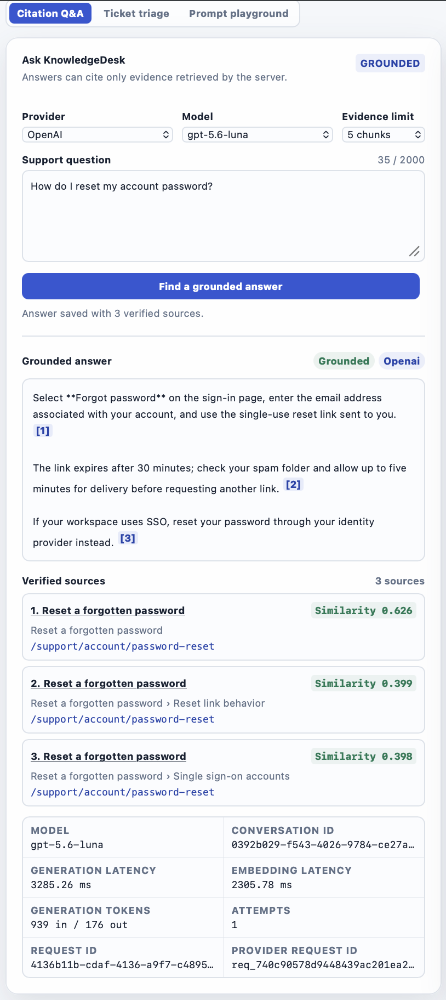

# Week 3 Citation Q&A evidence

Evidence date: 2026-08-26

Live service: [ai-learning-3y5vyfqynq-uw.a.run.app](https://ai-learning-3y5vyfqynq-uw.a.run.app/)

Application commit: `b09ff2a40b6a592653a6575378c2cbeef7ea7877`

## Release chain

The user explicitly ran the documented release command after PR 28 merged. It
produced this traceable chain:

| Boundary | Verified value |
|---|---|
| Cloud Build | `ed03400f-8882-4404-97ed-796b12f387b3` (`SUCCESS`) |
| Build start and duration | 2026-08-27 05:51:46Z; 1 minute 10 seconds |
| Application commit | `b09ff2a40b6a592653a6575378c2cbeef7ea7877` |
| Artifact Registry image | `us-west1-docker.pkg.dev/ai-learning-ved-2026/ai-learning/ai-learning` |
| Image digest | `sha256:68464163d980c6b2cef80c54d3f5f2492688212591b11e11c3f376cc75b5b6d5` |
| Cloud Run revision | `ai-learning-git-b09ff2a40b6a` |
| Candidate tag | `git-b09ff2a40b6a` |
| Serving traffic | 100% to the verified Week 3 revision |
| Previous known-good revision | `ai-learning-git-0a9e55479ea2`, retained at 0% |

Cloud Build validated the 30-case Ticket Triage dataset and the 20-question RAG
dataset before publishing the image. The release deployed the resolved digest
as a zero-traffic candidate, smoke-tested its tagged URL, promoted it, and
repeated the smoke test against the public service. Neither smoke test called a
provider or Postgres endpoint.

## Versioned RAG acceptance evaluation

The complete 20-question acceptance set ran through the real local
retrieve-answer-persist pipeline against the fictional remote corpus. The
ignored report contained aggregate metrics only.

| Signal | Result |
|---|---:|
| Dataset | 12 answerable, 4 ambiguous, 4 unanswerable |
| Dataset SHA-256 | `7cd6be7d6af670adf4b9accab489d9cb1bcb154561cce61339c2a4dfb3e3d775` |
| Provider/model | OpenAI / `gpt-5.6-luna` |
| Configuration | top-k 5, concurrency 1, 20 cases |
| Completion rate | 20/20 (100%) |
| Answerable retrieval hit rate at k | 12/12 (100%) |
| Answerable answer rate | 12/12 (100%) |
| Ambiguous abstention rate | 3/4 (75%) |
| Unanswerable abstention rate | 4/4 (100%) |
| Application-verified citation validity | 100% |
| Forbidden-document leakage | 0 cases |
| p50 / p95 duration | 2,004.39 ms / 3,454.66 ms |
| Generation attempts | 20 |
| Failures | 0 |

The run recorded 266 embedding input tokens, 18,749 generation input tokens,
and 1,995 generation output tokens. The metrics establish retrieval and
contract behavior on this small fictional set; they do not establish semantic
answer correctness or a production latency SLO.

## Deployed browser acceptance

The user asked the deployed OpenAI path how to reset an account password. The
request succeeded on its first attempt and the application reported that it
saved the answer with three verified sources.

| Signal | Observed value |
|---|---:|
| Verified citations and source cards | 3 |
| Retrieval similarities | 0.626, 0.399, 0.398 |
| Embedding latency | 2,305.78 ms |
| Generation latency | 3,285.26 ms |
| Generation tokens | 939 input / 176 output |
| Generation attempts | 1 |

All three source cards referred to distinct chunks from the public fictional
`account-password-reset` document. Inline markers mapped to those cards, and
the returned conversation identifier demonstrated that the atomic persistence
operation completed before the success response. The database rows were not
independently queried as part of this evidence step.

The original screenshot SHA-256 is
`b41b5bfa00ae433feb202110d6417ad6a51ed771c18044a3eefa16f1546bfe0f`.
It contains fictional content and partial operational identifiers, but no API
key, database credential, or real customer data.

## Runtime and data boundary

- Cloud Run uses the dedicated `ai-learning-runtime` service identity.
- OpenAI, Anthropic, and Supabase database credentials are injected from
  explicit Secret Manager version `1`; no values appear in Git, Cloud Build,
  the image, or the release output.
- Database readiness checks configured presence without querying Postgres on
  every health probe.
- The browser cannot supply a database URL, tenant, or visibility override.
- Unauthenticated retrieval is restricted to the server-owned demo tenant and
  public documents.
- Documents, embeddings, conversations, messages, citations, and safe model
  telemetry survive web-container replacement in Supabase Postgres.
- Cloud Run remains capped at one instance and can scale to zero.

## Cost and limitations

Provider token usage is recorded above, but model cost is not claimed because
the exact price basis and provider bill were not reconciled for this evidence.
Cloud Build, Cloud Run, Artifact Registry, Secret Manager, and Supabase usage
are also not presented as a zero-cost guarantee; the existing budget and
scale-to-zero guardrails remain active.

This remains a public, unauthenticated learning service with no rate limit. The
corpus and acceptance set are intentionally small, retrieval is exact rather
than indexed approximate search, answer quality was not human-scored, and an
explicit same-revision restart drill was not performed. The successful new
revision did, however, cold-start against previously persisted corpus data.
